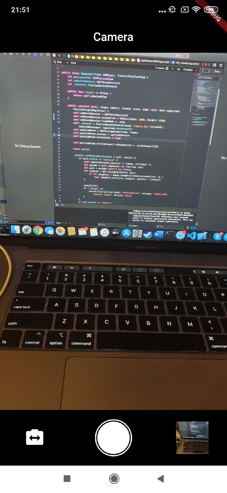
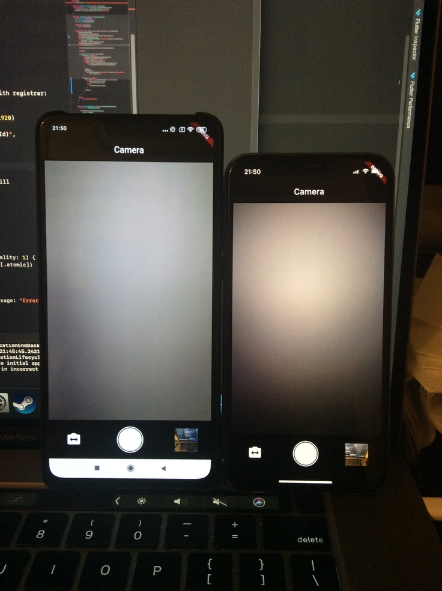

# camera_kit

Camera Plugin (PlatformView)

Здесь больше не поддерживается, ушел в коммерцию)

Плагин камеры Flutter для iOS (CameraKit) и Android (CameraX)

Пока еще в разработке, вообще в принципе опробации

- Zoom
- AutoFocus
- AutoExposure
- Flash (auto)

## Getting Started

Demo in [apk-demo (click)](https://github.com/FroseMan97/camerakit-plugin/tree/master/apk-demo) folder.

Before starting, give access to the ```CAMERA``` and ```STORAGE```

   

This project is a starting point for a Flutter
[plug-in package](https://flutter.dev/developing-packages/),
a specialized package that includes platform-specific implementation code for
Android and iOS.
